# Object Oriented Programming and Data Structure
## CCP6124-T2610 Assignment Report
### TT4L - Group 2

## 1.0 INTRODUCTION

### 1.1 Project Overview
The Virtual ASM Interpreter is a simplified virtual machine developed in C++ to simulate the execution of assembly language programs. The system reads instructions from an assembly source file, decodes each instruction, executes it through the virtual CPU, and updates the corresponding registers, memory, stack, and status flags.

The interpreter supports arithmetic operations, data movement, memory access, input/output, stack manipulation, and bitwise shift and rotate instructions. Throughout the implementation, Object-Oriented Programming (OOP) concepts such as encapsulation, inheritance, polymorphism, composition, and aggregation are applied to create a modular and maintainable software architecture.

The project also demonstrates the implementation of custom data structures without relying on the restricted Standard Template Library (STL) containers, fulfilling the assignment requirements.

### 1.2 Virtual Machine Specifications

| Component | Specification |
| :--- | :--- |
| **General Registers** | 8 Registers (R0 to R7) |
| **Register Size** | 8-bit signed integer (-128 to 127) |
| **Program Counter (PC)** | 1 Byte |
| **Stack Index (SI)** | 1 Byte |
| **Memory** | 64 Bytes |
| **Memory Address Range** | 0 to 63 |
| **Flags** | CF, OF, UF, ZF |
| **Interpreter Core** | Runner executes assembly instructions |

The virtual machine consists of eight general-purpose registers, a program counter (PC), a stack index (SI), four status flags (OF, UF, CF, and ZF), and a 64-byte memory space. The Runner (Interpreter) loads and executes assembly instructions while updating the state of these components throughout program execution.

## 2.0 SYSTEM ARCHITECTURE

This part presents the overall architecture of the Virtual ASM Interpreter. It explains the responsibilities of each software component, the relationships between classes, and how different modules cooperate to execute assembly language programs.

### 2.1 Overall System Architecture

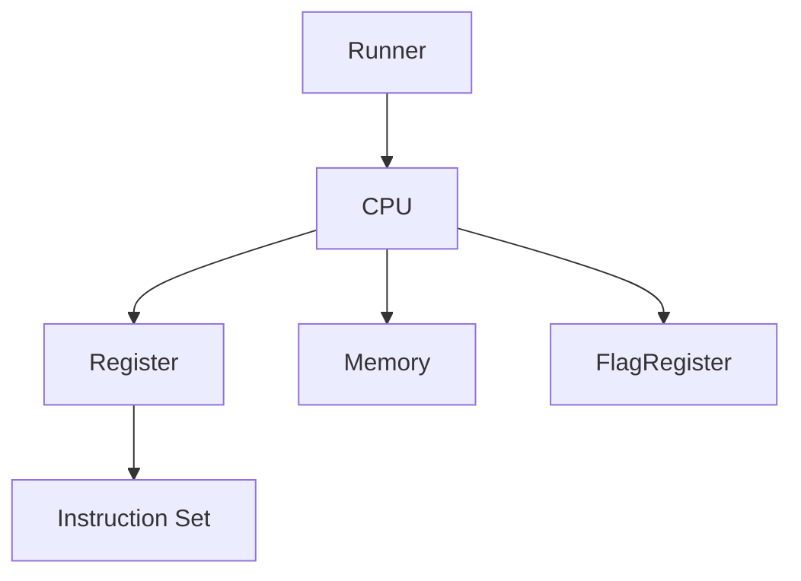

The Runner loads the assembly program from a text file and stores the instructions. During execution, the CPU fetches one instruction at a time, delegates the operation to the corresponding instruction object, and updates registers, memory, stack, and flags accordingly.

### 2.2 Class Responsibilities

| Class | Responsibility |
|---|---|
| Runner | Loads the assembly program, decodes instructions, manages execution flow, and coordinates the entire interpreter. |
| CPU | Executes instructions and manages registers, memory, stack, program counter (PC), stack index (SI), and flags. |
| Memory | Store 64 bytes of virtual memory and provides read/write operations. |
| Register | Base class representing a single 8-bit signed register. |
| GeneralRegister | Represents one of the eight general-purpose registers (R0–R7). |
| FlagRegister | Stores and manages the Overflow (OF), Underflow (UF), Carry (CF), and Zero (ZF) flags. |
| Instruction | Abstract base class defining the common interface for all assembly instructions. |
| ArithmeticInstruction | Intermediate class that provides common functionality for arithmetic operations and flag updates. |
| RotateInstruction | Intermediate class for rotation instructions (ROL and ROR). |
| IncDecInstruction | Intermediate class for increment and decrement instructions (INC and DEC). |
| Stack<T> | Custom stack implementation used for PUSH and POP operations. |
| Queue<T> | Custom queue implementation used to temporarily store assembly instructions during program loading. |
| Vector<T> | Custom dynamic array used throughout the interpreter for instruction storage and memory management. |

### 2.3 UML Class Diagram

#### 2.3.1 Core System Class Diagram

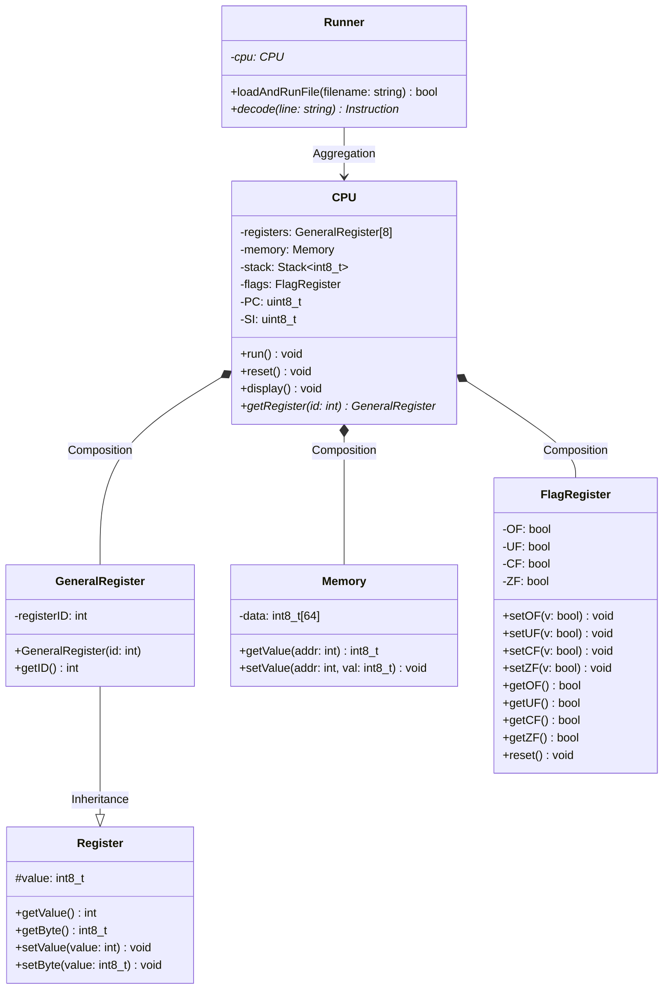

#### 2.3.2 Instruction Hierarchy Diagram

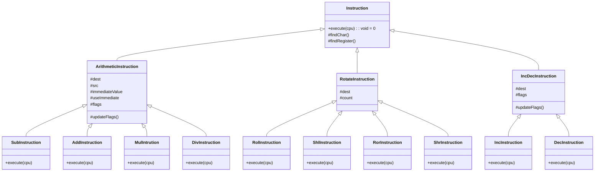

#### 2.3.3 Direct Instruction Class

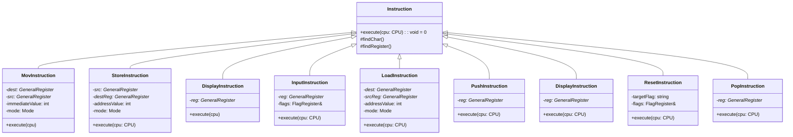

## 3.0 ALGORITHMS USED
### 3.1 Francis's Implementation
#### 3.1.1 Runner Algorithm
* Reading .asm file
* Ignoring empty lines
* Program initialization
* Execution flow

#### 3.1.2 UML Activity Diagram
**`decode()` function:**

After all instructions written by user decode() leads them to their respective instruction classes.
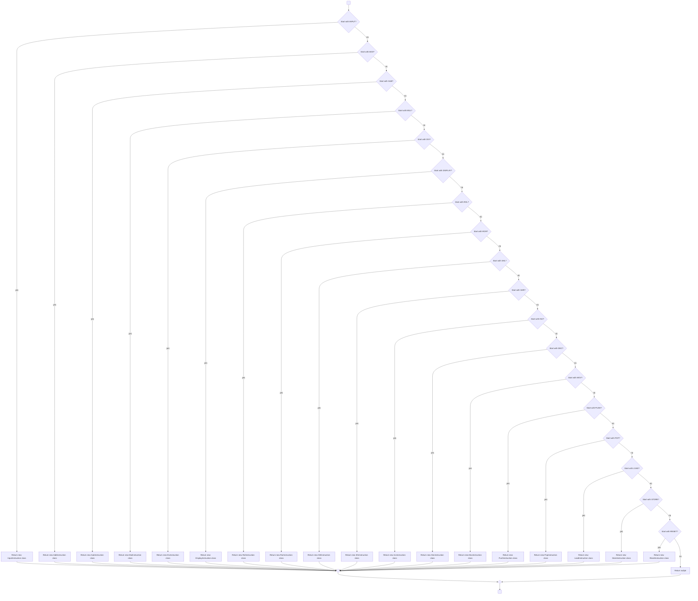

**`dequeueAndDecode()` function:**

Pulls the next available string line from the queue and increments the line counter. It then immediately passes that string into fileDecode().
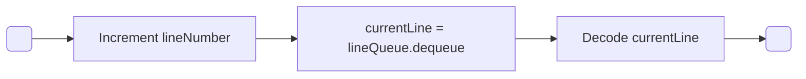

**`cleanup()` function:**

Used to prevent memory leaks.
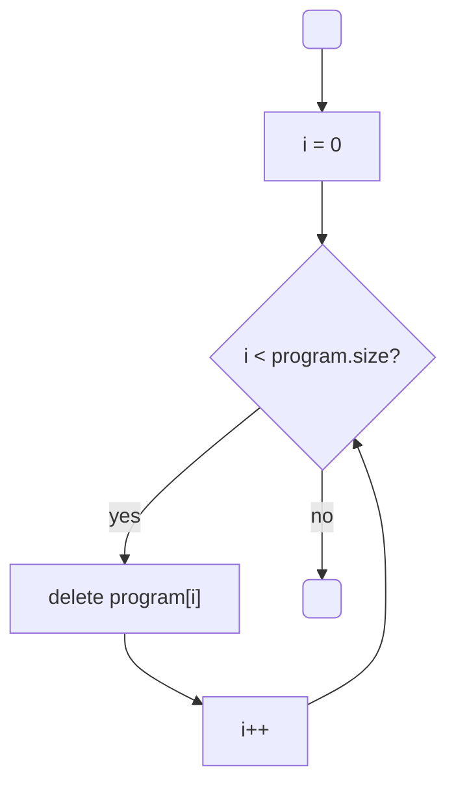

**`fileDecode()` function:**

Decodes a text string into an Instruction object, pushes it to the program vector, and handles error catching.
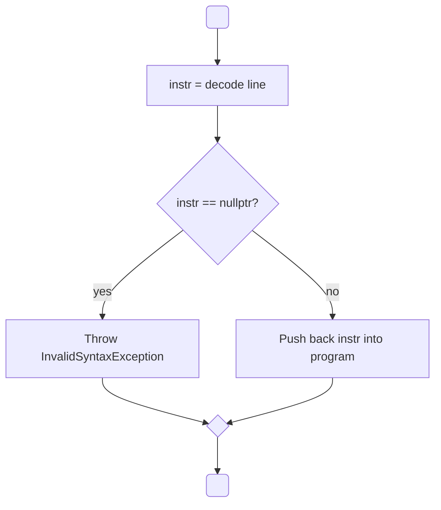

**`populateQueue()` function:**

Reads an opened file line-by-line, cleans up the strings, and stores any non-empty lines into a queue for later execution.
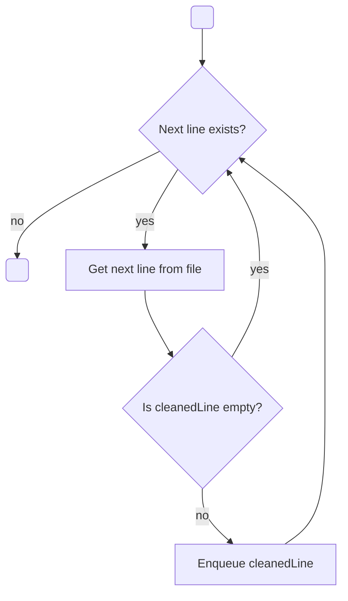

**`openFile()` function:**

Opens the file.
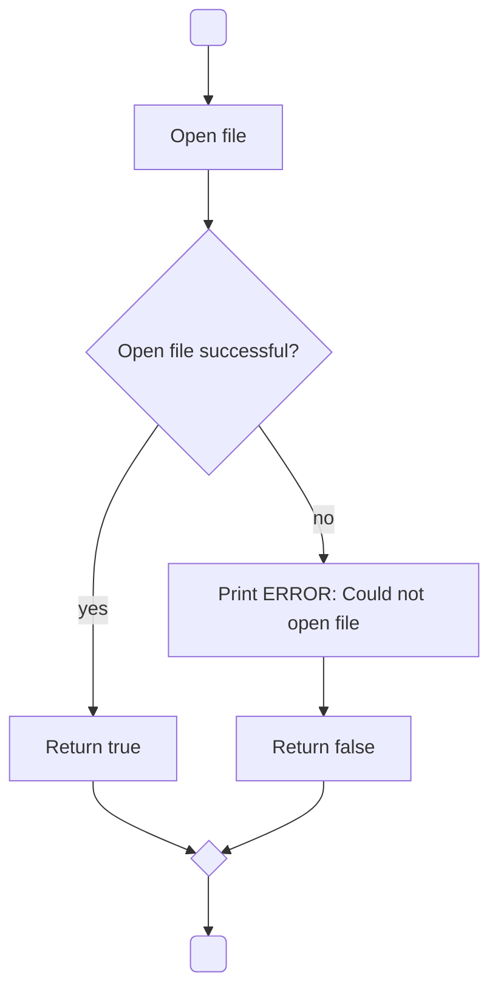

**`trim()` function:**

Isolates the core content of a string by excluding any leading or trailling whitespace.
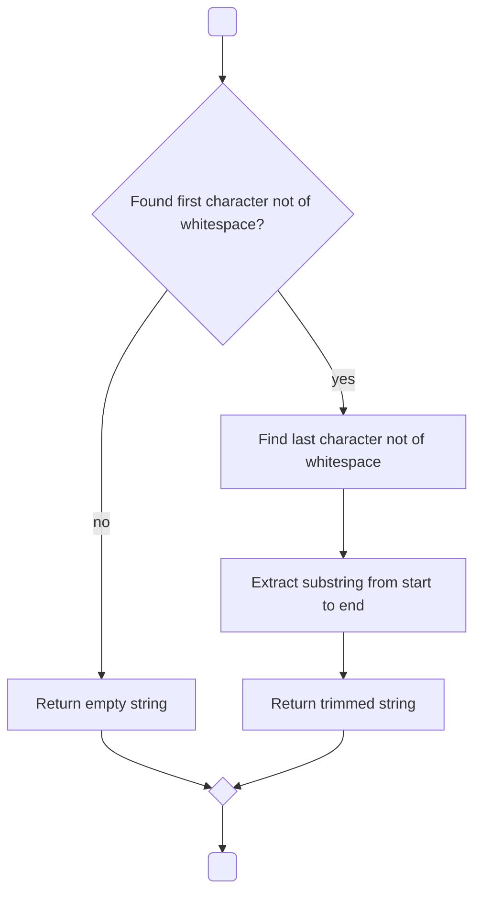

**`loadAndRunFule()` function:**

Load and run the file.
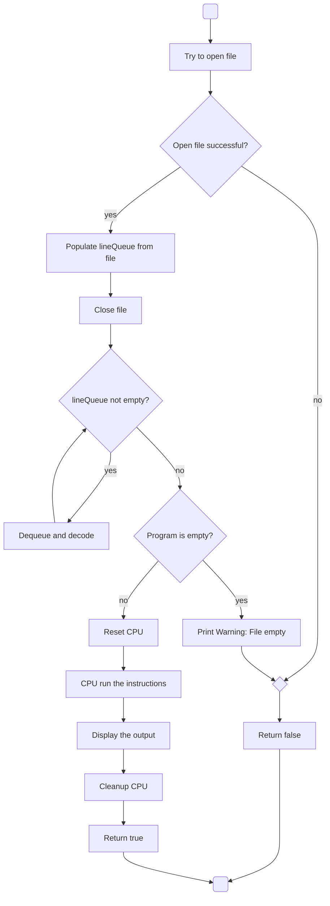

#### 3.1.3 Custom Queue Algorithm
* Enqueue instruction
* Dequeue instruction

**Constructor**
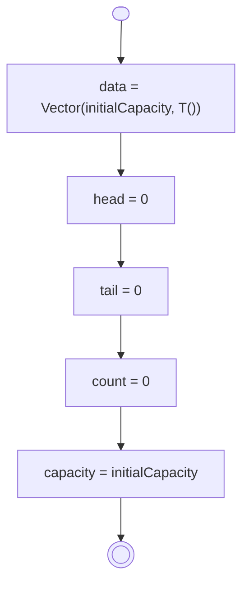

**`resize()` function:**

Resizes the queue.
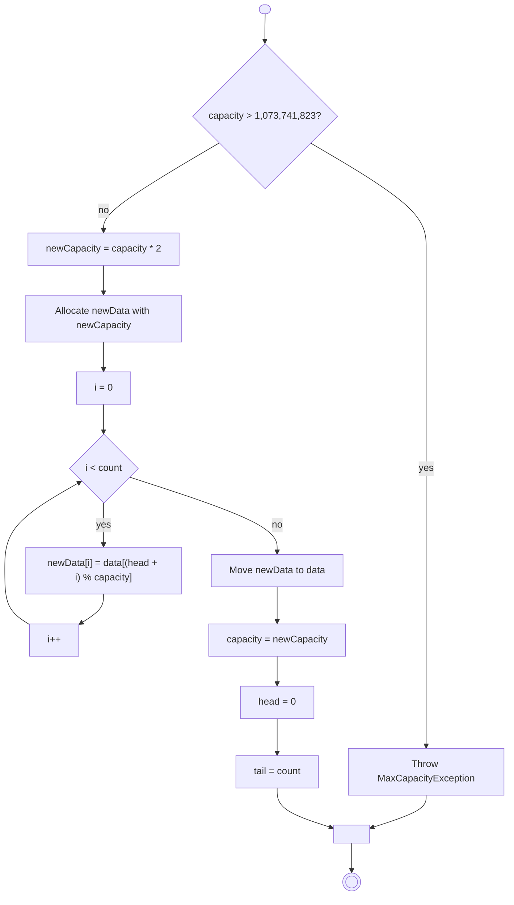

**`dequeue()` function:**

Dequeues an element from the queue.
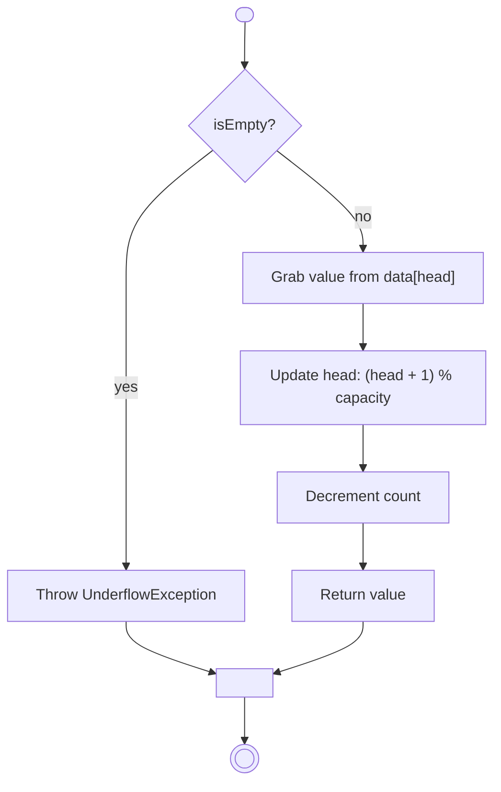

**`enqueue()` function:**

Enqueues an eleement into the queue.
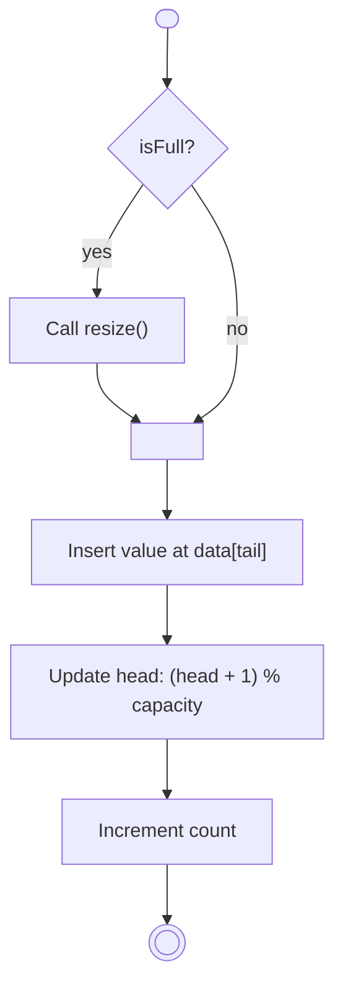

**`isFull()` and `isEmpty()` functions**

Checks if the queue is full or empty.
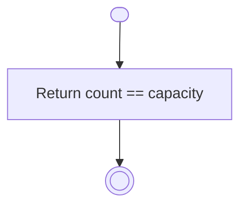
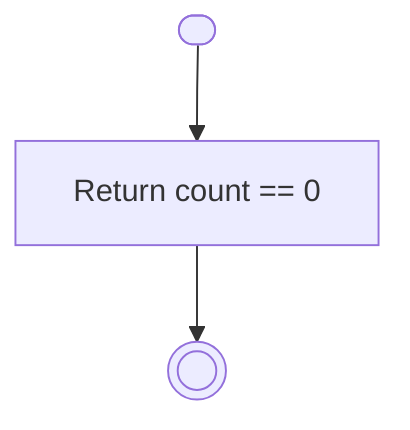

**`getSize()` and `getCapacity()` functions:**

Returns the size and capacity of the queue.
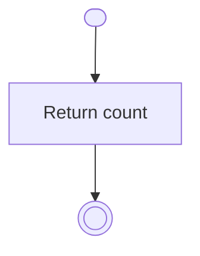
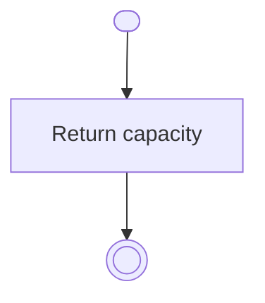

#### 3.1.5 Custom Stack Algorithm
* Push
* Pop

**Constructor:**
```mermaid
graph TD
    Start([ ]) --> A["capacity = size"]
    A --> B["topIndex = -1"]
    B --> C["data = new T[capacity]"]
    C --> End((( )))
```

**Move constructor:**
```mermaid
graph TD
    Start([ ]) --> A["data = other.data"]
    A --> B["capacity = other.capacity"]
    B --> C["topIndex = other.topIndex"]
    C --> D["other.data = nullptr"]
    D --> E["other.capacity = 0"]
    E --> F["other.topIndex = -1"]
    F --> End((( )))
```

**Destructor:**
```mermaid
graph TD
    Start([ ]) --> A["Delete data"]
    A --> End((( )))
```

**Overload = operator:**

Acts as a move assignment operator.
```mermaid
graph TD
    Start([ ]) --> Cond{"Does this == &other?"}
    Cond -- yes --> Skip["Skip transfer"]
    Skip --> Merge1[ ]
    Cond -- no --> A["Delete current data array"]
    A --> B["data = other.data"]
    B --> C["capacity = other.capacity"]
    C --> D["topIndex = other.topIndex"]
    D --> E["other.data = nullptr"]
    E --> F["other.capacity = 0"]
    F --> G["other.topIndex = -1"]
    G --> Merge1
    Merge1 --> H["Return *this"]
    H --> End((( )))
```

**`pop()` function:**

Pops an element from the stack.
```mermaid
graph TD
    Start([ ]) --> Cond{"Is isEmpty?"}
    Cond -- yes --> Ex["Throw UnderflowException"]
    Ex --> Merge[ ]
    Cond -- no --> A["Retrieve value at data[topIndex]"]
    A --> B["Decrement topIndex"]
    B --> C["Return value"]
    C --> Merge
    Merge --> End((( )))
```

**`push()` function:**

Pushes an element into the stack.
```mermaid
graph TD
    Start([ ]) --> Cond{"Is topIndex >= capacity - 1?"}
    Cond -- yes --> Ex["Throw StackOverflowException"]
    Ex --> Merge[ ]
    Cond -- no --> A["Increment topIndex"]
    A --> B["Store value at data[topIndex]"]
    B --> Merge
    Merge --> End((( )))
```

**`isEmpty()` function:**

Checks if the stack is empty.
```mermaid
graph TD
    Start([ ]) --> A["return topIndex == -1"]
    A --> End((( )))
```

**`getCapacity()` and `getTopIndex()` functions:**

Returns the capacity and the top index of the stack.
```mermaid
graph TD
    Start([ ]) --> A["return capacity"]
    A --> End((( )))
```
```mermaid
graph TD
    Start([ ]) --> A["return topIndex"]
    A --> End((( )))
```

#### 3.1.6 Register & General Register Algorithm
* Register initialization
* Read/Write register
* Value validation

**Register constructor:**
```mermaid
graph TD
    Start([ ]) --> A["value = 0"]
    A --> End((( )))
```

**`setByte()` and `getByte()` functions:**

Setters and getters that return in bytes.
```mermaid
graph TD
    Start([ ]) --> A["value = newValue"]
    A --> End((( )))
```
```mermaid
graph TD
    Start([ ]) --> A["Return value"]
    A --> End((( )))
```

**`setValue()` and `getValue()` functions:**

Setters and getters for normal values.
```mermaid
graph TD
    Start([ ]) --> A["value = static_cast<int8_t>(newValue)"]
    A --> End((( )))
```
```mermaid
graph TD
    Start([ ]) --> A["Return static_cast<int>(value)"]
    A --> End((( )))
```

**General register constructor:**
```mermaid
graph TD
    Start([ ]) --> A["Call Register Constructor"]
    A --> B["registerID = id"]
    B --> End((( )))
```

**`getID()` function:**

Returns the specific integer ID number that was assigned to the general register.
```mermaid
graph TD
    Start([ ]) --> A["Return registerID"]
    A --> End((( )))
```

#### 3.1.7 PUSH / POP Instruction Algorithm
**Constructor:**
```mermaid
graph TD
    Start([ ]) --> Cond{"Does regStr contain ',' OR is it empty/whitespace?"}
    Cond -- yes --> Ex["Throw InvalidSyntaxException"]
    Ex --> Merge[ ]
    Cond -- no --> A["Find character 'R' in regStr"]
    A --> B["Look up and assign GeneralRegister pointer"]
    B --> Merge
    Merge --> End((( )))
```

**`pop()` function:**

Handles the POP instruction.
```mermaid
graph TD
    Start([ ]) --> Cond{"Is reg pointer null?"}
    Cond -- yes --> Merge[ ]
    Cond -- no --> A["Pop byte from CPU Stack"]
    A --> B["Store value in register"]
    B --> Merge 
    Merge --> End((( )))
```

**`push()` function:**

Handles the PUSH instruction.
```mermaid
graph TD
    Start([ ]) --> Cond{"Is reg pointer null?"}
    Cond -- yes --> Merge[ ]   
    Cond -- no --> A["Get byte value from register"]
    A --> B["Push value onto CPU Stack"]
    B --> Merge    
    Merge --> End((( )))
```

#### 3.1.8 Main Algorithm
**`main()` function:**

This is the primary entry point of the application that ensures the user provided exactly one filename argument via the command line. It then instantiates the necessary hardware components like the FlagRegister, CPU, and Runner, before executing the file.
```mermaid
graph TD
    Start([ ]) --> Cond1{"argc == 2?"} 
    Cond1 -- no --> Print["Print usage to std::cerr"]
    Print --> Merge1[ ]  
    Cond1 -- yes --> Init1["Initialize FlagRegister & CPU"]
    Init1 --> Init2["Initialize Runner with CPU"]
    Init2 --> Cond2{"interpreter.loadAndRunFile?"} 
    Cond2 -- no --> Merge1
    Cond2 -- yes --> Ret0["Return 0"] 
    Merge1 --> Ret1["Return 1"]
    Ret1 --> Merge2[ ]
    Ret0 --> Merge2
    Merge2 --> End((( )))
```

### 3.2 Henry's Implementation
#### 3.2.1 Custom Vector Algorithm
* Dynamic storage of instructions

**Constructor:**
```mermaid
graph TD
    Start( ) --> Step1["Pass initialCapacity as parameter"]
    Step1 --> Step2["Set capacity = initialCapacity"]
    Step2 --> Dec1{"if (capacity < 1)"}
    Dec1 -- Yes --> Step3a["throw Errors::NegativeSizeException"]
    Dec1 -- No --> Step3b["data = new T[capacity]"]
    Step3a --> End( )
    Step3b --> End
```

**Constructor for pre-filling items:**
```mermaid
graph TD
    Start( ) --> Step1["Pass size and default values as parameters"]
    Step1 --> Step2["currentSize(size)"]
    Step2 --> Step3["capacity(size)"]
    Step3 --> Dec1{"if (size < 0)"}
    Dec1 -- Yes --> Step4a["throw Errors::NegativeSizeException"]
    Dec1 -- No --> Step4b["data = new T[capacity]"]
    Step4a --> End( )
    Step4b --> Dec2{"for (size_t i = 0; i < currentSize; i++)"}
    Dec2 -- Yes --> Step5["data[i] = defaultValue"]
    Step5 --> Dec2
    Dec2 -- No --> End
```

**Destructor:**
```mermaid
graph LR
    Start( ) --> Step1["~Vector()"] --> Step2["delete[] data"] --> End( )
```

**`push_back()` function:**

Push back an element into the vector, used to append instruction into the program vector.
```mermaid
graph TD
    Start( ) --> Step1["Pass the element to add as parameter"]
    Step1 --> Dec1{"if (currentSize == capacity)"}
    Dec1 -- Yes --> Step2a["resize()"]
    Dec1 -- No --> Step2b["add the element"]
    Step2a --> Step2b
    Step2b --> End( )
```

**`replace()` function:**

Replaces an element with a new one in a vector, used with queue functions in the program.
```mermaid
graph TD
    Start( ) --> Step1["Pass the index to be replaced and element"]
    Step1 --> Dec1{"if (index < 0 || index >= currentSize)"}
    Dec1 -- Yes --> Step2a["throw Errors::IndexOutOfBoundsException()"]
    Dec1 -- No --> Step2b["data[index] = value"]
    Step2a --> End( )
    Step2b --> End
```

**Overloading [] operator:**

Used for accessing an element in the vector.
```mermaid
graph TD
    Start( ) --> Step1["T& operator[](int index)"]
    Step1 --> Dec1{"if (index < 0 || index >= currentSize)"}
    Dec1 -- Yes --> Step2a["throw Errors::IndexOutOfBoundsException()"]
    Dec1 -- No --> Step2b["return data[index]"]
    Step2a --> End( )
    Step2b --> End
```

**Overloading = operator:**

A move assignment operator for the vector.
```mermaid
graph TD
    Start( ) --> Step1["Vector& operator=(Vector&& other) noexcept"]
    Step1 --> Dec1{"if (this != &other)"}
    Dec1 -- No --> Step2a["return *this"]
    Dec1 -- Yes --> Step2b["delete[] data"]
    Step2b --> Step3["data = other.data"]
    Step3 --> Step4["currentSize = other.currentSize"]
    Step4 --> Step5["capacity = other.capacity"]
    Step5 --> Step6["other.data = nullptr"]
    Step6 --> Step7["other.currentSize = 0"]
    Step7 --> Step8["other.capacity = 0"]
    Step8 --> Step2a
    Step2a --> End( )
```

**`size()` and `isEmpty()` functions:**

Checks if vector is empty and its’ size.
```mermaid
graph TD
    subgraph size()
        StartSize( ) --> StepSize["return currentSize"] --> EndSize( )
    end

    subgraph isEmpty()
        StartEmpty( ) --> StepEmpty["return currentSize == 0"] --> EndEmpty( )
    end
```

#### 3.2.2 Flag Register Algorithm
* OF
* UF
* CF
* ZF update logic

**Constructor:**
```mermaid
graph LR
    Start( ) --> Step1["OF(false)"]
    Step1 --> Step2["UF(false)"]
    Step2 --> Step3["CF(false)"]
    Step3 --> Step4["ZF(false)"]
    Step4 --> End( )
```

**`getOF()`, `getUF(`), `getCF()`, `getZF()` functions:**

Getters for flags.
```mermaid
graph TD
    subgraph OF Getter
        StartOF( ) --> StepOF["return static_cast<int>(OF);"] --> EndOF( )
    end

    subgraph UF Getter
        StartUF( ) --> StepUF["return static_cast<int>(UF);"] --> EndUF( )
    end

    subgraph CF Getter
        StartCF( ) --> StepCF["return static_cast<int>(CF);"] --> EndCF( )
    end

    subgraph ZF Getter
        StartZF( ) --> StepZF["return static_cast<int>(ZF);"] --> EndZF( )
    end
```

**`resetFlags()` function:**

Reset all flags.
```mermaid
graph TD
    Start( ) --> Step["OF = UF = CF = ZF = false"] --> End( )
```

#### 3.2.3 Base Instruction Algorithm
* Instruction abstraction
* Virtual execution

Virtual `execute()` function and destructor for all children instructions class:
* `virtual void execute(CPU& cpu) = 0;`
* `virtual ~Instruction() {}`

**`findChar()` function:**
Searches a given string for a specific character, like ‘R’ in user instructions and returns its exact index position.
```mermaid
graph TD
    Start( ) --> Step1["Pass CPU, the word, and char to find as parameters"]
    Step1 --> Step2["Find the character"]
    Step2 --> Dec1{"if (character is invalid)"}
    Dec1 -- Yes --> Step3a["throw Errors::InvalidSyntaxException()"]
    Dec1 -- No --> Step3b["return character"]
    Step3a --> End( )
    Step3b --> End
```

**`findRegister()` function:**

Extracts a number from a string, verifies that it falls within the valid register ID range of 0 to 7, and returns a pointer to that specific general register inside the CPU.
```mermaid
graph TD
    Start( ) --> Step1["Pass CPU, the string with register and position of R"]
    Step1 --> Step2["Set the id as the string register with the position R + 1"]
    Step2 --> Dec1{"if (id < 0 || id >= 8)"}
    Dec1 -- Yes --> Step3a["Errors::RegisterOutOfBoundsException()"]
    Dec1 -- No --> Step3b["return &cpu.getRegister(id)"]
    Step3a --> End( )
    Step3b --> End
```

#### 3.2.4 Arithmetic Instruction Algorithm
* ADD
* SUB
* MUL
* DIV

**Constructor:**
```mermaid
graph TD
    Start( ) --> Step1["Pass CPU and user input command as parameters"]
    Step1 --> Dec1{"try"}
    Dec1 -- No --> Step2a["catch error"]
    Step2a --> End( )
    Dec1 -- Yes --> Step2b["Find the position of comma"]
    Step2b --> Dec2{"if comma is missing"}
    Dec2 -- Yes --> Step3a["throw Errors::InvalidSyntaxException()"]
    Step3a --> End
    Dec2 -- No --> Step3b["find destination slot"]
    Step3b --> Step4["find source slot"]
    Step4 --> Step5["size_t destR = Instruction::findChar(cpu, destStr, 'R')"]
    Step5 --> Step6["dest = Instruction::findRegister(cpu, destStr, destR)"]
    Step6 --> Step7["size_t srcR = srcStr.find('R')"]
    Step7 --> Dec3{"if source is missing"}
    Dec3 -- Yes --> Step8a["use the value in source slot as<br/>immediateValue"]
    Step8a --> Step9a["useImmediate = true"]
    Step9a --> End
    Dec3 -- No --> Step8b["src = Instruction::findRegister(cpu, srcStr, srcR)"]
    Step8b --> End
```

**`updateFlags()` function:**

Update all flags properly for arithmetic instructions.
```mermaid
graph LR
    Start( ) --> Step1["updateFlags(int result, unsigned int unsignedResult)"]
    Step1 --> Step2["flags.setOF(result > 127)"]
    Step2 --> Step3["flags.setUF(result < -128)"]
    Step3 --> Step4["flags.setCF(unsignedResult > 255)"]
    Step4 --> Step5["flags.setZF(static_cast<int8_t>(result) == 0)"]
    Step5 --> End( )
```

**`execute()` function in all arithmetic operation classes (ADD, SUB, MUL, DIV):**

Handles the execution of all arithmetic operations.
```mermaid
graph TD
    Start( ) --> Step1["Pass cpu as parameter"]
    Step1 --> Step2["int destVal = dest->getValue()"]
    Step2 --> Step3["int srcVal"]
    Step3 --> Dec1{"if (useImmediate)"}
    Dec1 -- Yes --> Step4a["srcVal = immediateValue"]
    Dec1 -- No --> Step4b["srcVal = src->getValue()"]
    Step4a --> Merge1
    Step4b --> Merge1
    Merge1(( )) --> Dec2{"FOR DIV ONLY<br/>if (srcVal == 0)"}
    Dec2 -- Yes --> Step5a["FOR DIV ONLY<br/>throw Errors::DivisionByZeroException()"]
    Dec2 -- No --> Step5b["ADD<br/>int result = destVal + srcVal<br/>SUB<br/>int result = destVal - srcVal<br/>MUL<br/>int result = destVal * srcVal<br/>DIV<br/>int result = destVal / srcVal"]
    Step5a --> End( )
    Step5b --> Step6["Perform operation again<br/>for unsignedResult"]
    Step6 --> Step7["updateFlags(result, unsignedResult)"]
    Step7 --> Step8["dest->setValue(result)"]
    Step8 --> End
```

#### 3.2.5 LOAD / STORE Algorithm
**LOAD and STORE constructors:**
```mermaid
graph TD
    Start([ ]) --> A
    A[Pass CPU and user input as parameters] --> B{Locate destination and source from command}
    B -- if command is invalid: Yes --> C[throw Error]
    B -- No --> D{if source = register}
    D -- Yes --> E[mode = REGISTER_ADDRESS]
    E --> F{Find the source/memory}
    D -- No --> G[mode = IMMEDIATE_ADDRESS]
    G --> F
    F --> End([ ])
```

**LOAD `execute()` function:**

Handles LOAD’s execution.
```mermaid
graph TD
    Start([ ]) --> B{if !dest}
    B -- No --> C{if mode == IMMEDIATE_ADDRESS}
    C -- No --> D["address = srcReg->getValue()"]
    D --> E
    C -- Yes --> E[address = addressValue]
    E --> F[get the memory value from address]
    F --> G[set destination register to the value]
    G --> End([ ])
    B -- Yes --> End([ ])
```

**STORE `execute()` function:**

Handles STORE’s execution.
```mermaid
graph TD
    Start([ ]) --> B{if !dest}
    B -- No --> C{if mode == IMMEDIATE_ADDRESS}
    C -- No --> D[address = register's value]
    D --> E
    C -- Yes --> E[address = addressValue]
    E --> F[store the source into the address]
    F --> End([ ])
    B -- Yes --> End([ ])
```

### 3.3 Kakit's Implementation
#### 3.3.1 Memory Algorithm
* Read memory
* Write memory

**Constructor:**
```mermaid
flowchart LR
    Start([ ]) --> createObj[Create Memory<br/>object]
    createObj --> initData[Initialize data with<br/>size 64<br/>and fill with 0]
    initData --> End([ ])
```

**Memory `getValue()` function:**

Get the address value
```mermaid
flowchart TD
    Start([ ]) --> checkAddr{Check<br/>address valid<br/>(0-63)}
    checkAddr -- no --> throwEx[Throw Exception]
    checkAddr -- yes --> retData[Return data[address]]
    throwEx --> mergeNode{ }
    retData --> mergeNode
    mergeNode --> End([ ])
```

**Memory `setvalue()` function:**

Sets int at address when it is valid
```mermaid
flowchart TD
    Start([ ]) --> checkAddr{Check<br/>address valid<br/>(0-63)} 
    checkAddr -- no --> actNo[Activity]
    checkAddr -- yes --> actYes[Activity]  
    actNo --> mergeNode{ }
    actYes --> mergeNode
    mergeNode --> End([ ])
```

**Memory `reset()` function:**

Reset all memory slot to 0
```mermaid
flowchart LR
    Start([ ]) --> setMem[Set all memory slots to 0<br/>(loop through 64 cells)] --> End([ ])
```

#### 3.3.2 CPU Execution Algorithm
* Fetch
* Decode
* Execute
* PC++

**Constructor:**

Store external flag, clear program counter, reset the set index and initialize the register.
```mermaid
flowchart LR
    Start([ ]) --> storeFlag[Store external flag<br/>reference]
    storeFlag --> setPC[Set PC = 0]
    setPC --> setSI[Set SI = 0]
    setSI --> initReg[Initialize registres<br/>R0-R7]
    initReg --> End([ ])
```

**`getPC()` function:**

The Interpreter retrieves the current instruction from memory by querying the instruction pointer.
```mermaid
flowchart LR
    Start([ ]) --> returnPC[Return PC] --> End([ ])
```

**`getRegister()` function:**

Check if any referenced register ID falls within the valid 0 to 7 range.
```mermaid
flowchart TD
    Start([ ]) --> checkId{Is id between<br/>0 and 7?}
    checkId -- no --> throwEx[Throw Exception]
    checkId -- yes --> returnReg[Return registers[id]]
    throwEx --> mergeNode{ }
    returnReg --> mergeNode
    mergeNode --> End([ ])
```

**`pushStackByte()` and `getStackByte()` function:**

Throwing an UnderflowException on failure
```mermaid
flowchart TD
    Start([ ]) --> attemptPush[Attempt to push<br/>value onto stack]
    attemptPush --> pushOk{Was push<br/>successful?}
    pushOk -- yes --> mergeNode{ }
    pushOk -- no --> dispErr[Display error]
    dispErr --> throwEx[Throw<br/>UnderflowException]
    throwEx --> mergeNode
    mergeNode --> End([ ])
```
```mermaid
flowchart TD
    Start([ ]) --> attemptPop[Attempt to pop<br/>value from stack]
    attemptPop --> popOk{Was pop<br/>successful?}
    popOk -- yes --> returnVal[Return value]
    popOk -- no --> dispErr[Display error]
    dispErr --> throwEx[Throw<br/>UnderflowException]
    returnVal --> mergeNode{ }
    throwEx --> mergeNode
    mergeNode --> End([ ])
```

**`reset()` function:**

Wipe registers/memory, clear flags, set PC = 0, and recalculate SI.
```mermaid
flowchart TD
    Start([ ]) --> foreach[For each register -><br/>set value = 0]
    foreach --> checkEmpty{Is empty<br/>stack?}
    checkEmpty -- yes --> mergeUpper{ }
    checkEmpty -- no --> act[Activity]
    act --> mergeUpper
    mergeUpper --> resetFlags[Reset flags]
    resetFlags --> resetMem[Reset Memory]
    resetMem --> setPC[PC = 0]
    setPC --> setSI[SI =<br/>stack top index + 1]
    setSI --> End([ ])
```

**`setPC()` function:**

The instruction pointer advances sequentially by committing the updated address.
```mermaid
flowchart LR
    Start([ ]) --> newPC[newPC=0] --> pcNew[PC= newPC] --> End([ ])
```

**`display()` function:**

Print out the CPU's exact state, either at the end of a program or between execution cycles.
```mermaid
flowchart TD
    Start([ ]) --> dispBegin[Display "Begin"]
    dispBegin --> initI[i = 0]
    initI --> loopI{i < 8}
    loopI -- yes --> dispReg["Display register[i]"]
    dispReg --> incI[i++]
    incI --> loopI
    loopI -- no --> dispFlag[Display flag]
    dispFlag --> dispPC[Display PC]
    dispPC --> initJ[j = 0]
    initJ --> loopJ{j < 8}
    loopJ -- yes --> dispMem["Display memory[i][j]"]
    dispMem --> incJ[j++]
    incJ --> loopJ
    loopJ -- no --> dispEnd[Display "End"]
    dispEnd --> End([ ])
```

#### 3.3.3 INPUT Instruction Algorithm
**Constructor:**
```mermaid
flowchart TD
    Start([ ]) --> regNull[reg = nullptr]
    regNull --> checkParam{Input has exactly 1 parameter?}   
    checkParam -- no --> throwEx[Throw InvalidSyntaxException]
    throwEx --> propEx[Exception propagated]  
    checkParam -- yes --> findR["Find position of 'R'"]
    findR --> findReg[Find register]
    propEx --> mergeNode{ }
    findReg --> mergeNode  
    mergeNode --> End([ ])
```

**`checkInput()` function:**

Check the invalid value and discard and bad input if the input is invalid
```mermaid
flowchart TD
    Start([ ]) --> cond{Condition}
    cond -- YES --> clearBuffer[Clear input buffer]
    cond -- NO --> clearReset["Clear input buffer Reset input stream Set value = 0"]
    clearBuffer --> mergeNode{ }
    clearReset --> mergeNode
    mergeNode --> End([ ])
```

**`execute()` function:**

Determine the value is it in the range of -128 to 127
```mermaid
flowchart TD
    Start([ ]) --> checkNull{Is reg == nullptr?}
    checkNull -- yes --> ret[Return]
    checkNull -- no --> displayPrompt[Display Prompt]
    displayPrompt --> readInput[Read user input]
    readInput --> resetFlags[Reset OF, UF, ZF Flags]
    resetFlags --> checkOF{Is value > 127?}
    checkOF -- yes --> storeOF[Store 127<br/>Set OF = true]
    checkOF -- no --> checkUF{Is value < -128?}
    checkUF -- yes --> storeUF[Store -128<br/>Set UF = true]
    checkUF -- no --> storeVal[Store value]
    storeVal --> checkZF{Is value == 0?}
    checkZF -- no --> doNothing[Do nothing]
    checkZF -- yes --> storeZF[Set ZF = true]
    ret --> mergeUpper{ }
    storeOF --> mergeUpper
    storeUF --> mergeUpper
    mergeUpper --> mergeLower{ }
    doNothing --> mergeLower
    storeZF --> mergeLower
    mergeLower --> End([ ])
```

#### 3.3.4 Rotate Instruction Algorithm
* ROL
* ROR

**ROL and ROR Constructor:**
  
Find ‘,’ from command, grab destination register and count, find "R" from destination register and get count
```mermaid
flowchart TD
    Start([ ]) --> findComma["Find ',' position"]
    findComma --> checkComma{Second comma exists?}
    checkComma -- yes --> throwEx1[Throw InvalidSyntaxException]
    throwEx1 --> propEx[Exception propagated]
    checkComma -- no --> splitArgs[Split args into destStr & countStr]
    splitArgs --> findR["Find 'R' position"]
    findR --> findDest[Find destination register]
    findDest --> convertCount[Convert countStr to integer]
    convertCount --> checkCount{Is count < 0?}
    checkCount -- no --> complete[Constructor Complete]
    checkCount -- yes --> throwEx2[Throw InvalidSyntax exception]
    propEx ----> mergeNode{ }
    throwEx2 --> mergeNode
    complete --> mergeNode
    mergeNode --> End([ ])
```

**ROR `execute()` function:**

Perform circular right bit rotation using shift and wrap-around logic
```mermaid
flowchart LR
    Start([ ]) --> readByte["Read destination register byte (v)"]
    readByte --> compShift["Compute shift (count % 8)"]
    compShift --> perfRot[Perform right rotation]
    perfRot --> writeBack[Write rotated value back to register]
    writeBack --> End([ ])
```

**ROL `execute()` function:**

Perform circular left bit rotation using shift and wrap-around logic
```mermaid
flowchart LR
    Start([ ]) --> readByte[Read destination register byte]
    readByte --> calcShift[Calculate shift = count mod 8]
    calcShift --> rotLeft[Rotate bits left]
    rotLeft --> storeReg[Store rotated value into destination register]
    storeReg --> End([ ])
```

#### 3.3.5 INC / DEC Algorithm
**INC and DEC Constructor:**

Validate that only one register is provided and maps it to a CPU register
```mermaid
flowchart TD
    Start([ ]) --> checkValid[Check regStr validity no comma, not empty]
    checkValid --> isValid{IsValid?}
    isValid -- no --> throwEx[Throw Invalid Syntax Exception]
    throwEx --> propEx[Exception propagated no]
    isValid -- yes --> findR["Find 'R'"]
    findR --> findDest[Find destination]
    propEx --> mergeNode{ }
    findDest --> mergeNode
    mergeNode --> End([ ])
```

**`updateFlag()` function:**

Update CPU status flags after INC/DEC operation.
```mermaid
flowchart LR
    Start([ ]) --> c1[Check result > 127]
    c1 --> s1[Set OF flag true/false]
    s1 --> c2[Check result < -128]
    c2 --> s2[Set UF flag true/false]
    s2 --> c3["Check result == 0 (as signed char)"]
    c3 --> act[Activity]
    act --> End([ ])
```

**INC `execute()` function:**

Increases the value stored in a register by 1.
```mermaid
flowchart TD
    Start([ ]) --> cond{Condition}
    cond -- no --> ret[Return]
    cond -- yes --> getReg[Get register value]
    getReg --> addOne[Add 1 increment]
    addOne --> updateFlags[Update flags result]
    updateFlags --> storeReg[Store result in register]
    ret --> mergeNode{ }
    storeReg --> mergeNode
    mergeNode --> End([ ])
```

**DEC `execute()` function:**

Decreases the value stored in a register by 1.
```mermaid
flowchart TD
    Start([ ]) --> checkDest{Is dest valid?}
    checkDest -- no --> ret[Return]
    checkDest -- yes --> getReg[Get register value]
    getReg --> subOne[Subtract 1 decrement]
    subOne --> updateFlags[Update flags result]
    updateFlags --> storeReg[Store result in register]
    ret --> mergeNode{ }
    storeReg --> mergeNode
    mergeNode --> End([ ])
```

### 3.4 Cayden's Implementation

#### 3.4.1 DISPLAY Instruction Algorithm
**3.4.1.1 Constructor Algorithms Description**
The constructor validates the DISPLAY instruction and finds the target register. If the syntax is invalid, an `InvalidSyntaxException` is thrown; otherwise, the register is stored for execution.
```mermaid
flowchart TD
    Start([ ]) --> receiveOp[Receive Register Operand]
    receiveOp --> multiOp{More than one operand?}
    multiOp -- Yes --> throwSyntax[Throw Invalid Syntax error]
    multiOp -- No --> findReg[Find Register]
    findReg --> regFound{Register Found?}
    regFound -- Yes --> storePtr[Store Register Pointer]
    regFound -- No ----> throwSyntax
    throwSyntax --> mergeNode{ }
    storePtr --> mergeNode
    mergeNode --> End([ ])
```

**3.4.1.2 `execute( )` Function Algorithms Description**
The `execute()` function reads the value from the target register and displays it on the console without modifying the CPU state.
```mermaid
flowchart TD
    Start([ ]) --> accessReg[Access Stored Register]
    accessReg --> readValue[Read Register Value]
    readValue --> displayVal[Display value]
    displayVal --> End([ ])
```

#### 3.4.2 Shift Instruction Algorithm
**3.4.2.1 Constructor Algorithms Description**
The constructor validates the shift instruction, parses the operands, and locates the destination register. It converts the shift count to  an integer and stores the required values for execution. An InvalidSyntaxException is thrown if the syntax is invalid or the operands are incorrect.
```mermaid
flowchart TD
    Start([ ]) --> receiveArgs[Receive Instruction Arguments]
    receiveArgs --> findSep["Find ' , ' Separator"]
    findSep --> splitReg[Split Register and Shift Count]
    splitReg --> locateReg[Locate Destination Register]
    locateReg --> regFound{Register Found?}
    regFound -- No --> throwEx[Throw Exception]
    regFound -- Yes --> readShift[Read Shift Count]
    readShift --> checkShift{Shift count < 0 ?}
    checkShift -- Yes --> throwEx
    checkShift -- No --> storeData[Store Register and Shift Count]
    throwEx --> mergeNode{ }
    storeData --> mergeNode
    mergeNode --> End([ ])
```

**3.4.2.2 `execute( )` Function Algorithms description**
The `execute()` function performs a logical left or right shift on the destination register using the stored shift count. The updated value is written back to the register, while a shift count of eight or more produces a result of zero.
```mermaid
flowchart TD
    Start([ ]) --> readReg[Read Register Value]
    readReg --> readShift[Read Shift Count]
    readShift --> checkShift{Shift Count >= 8?}
    checkShift -- Yes --> resZero[Result = 0]
    checkShift -- No --> performShift[Perform shift]
    resZero --> storeReg[Store Result into Register]
    performShift --> storeReg
    storeReg --> End([ ])
```

#### 3.4.3 RESET Instruction Algorithm
**3.4.3.1 RESET constructor algorithms description**
The constructor validates the target flag of the RESET instruction and stores it for execution. An `InvalidSyntaxException` is thrown if the specified flag is invalid.
```mermaid
flowchart TD
    Start([ ]) --> receiveFlag[Receive Target flag]
    receiveFlag --> trimSpace[Trim Space]
    trimSpace --> checkValid{Is flag valid?}
    checkValid -- No --> throwException[Throw Exception]
    checkValid -- Yes --> storeFlag[Store target flag]
    throwException --> mergeNode{ }
    storeFlag --> mergeNode
    mergeNode --> End([ ])
```

**3.4.3.2 `execute( )` Function algorithms description**
The execute() function clears the selected status flag stored during object construction. It checks the target flag and resets the corresponding flag in the FlagRegister by setting its value to false. The remaining flags remain unchanged throughout the execution process.
```mermaid
flowchart TD
    Start([ ]) --> readFlag[Read target flag]
    readFlag --> checkCF{CF?}
    checkCF -- Yes --> resetCF[Reset CF]
    checkCF -- No --> checkZF{ZF?}
    checkZF -- Yes --> resetZF[Reset ZF]
    checkZF -- No --> checkUF{UF?}
    checkUF -- Yes --> resetUF[Reset UF]
    checkUF -- No --> resetOF[Reset OF]
    resetCF --> mergeNode{ }
    resetZF --> mergeNode
    resetUF --> mergeNode
    resetOF --> mergeNode
    mergeNode --> End([ ])
```

#### 3.4.4 MOV Instruction Algorithm
**3.4.4.1 MOV Constructor Algorithm Description**
The MOV instruction transfers data to a destination register. It validates the syntax, identifies the source operand type, and stores the required information for execution. The value is then copied to the destination register without affecting the CPU status flags.
```mermaid
flowchart TD
    Start([ ]) --> receiveArgs[Receive Instruction Arguments]
    receiveArgs --> locateComma1[Locate the comma in the user input command]
    locateComma1 --> commaFound{Comma found?}
    commaFound -- No --> throwException["Throw InvalidSyntaxException()"]
    commaFound -- Yes --> locateComma2[Locate the comma in the user input command]
    locateComma2 --> checkInvalid{If user input command is invalid}
    checkInvalid -- Yes --> throwException
    checkInvalid -- No --> locatePositions[Locate positions of destination and source]
    locatePositions --> checkMemory{if source slot = memory reference}
    checkMemory -- Yes --> modeMemory[mode = memory]
    checkMemory -- No --> checkRegister{else if source slot = register}
    checkRegister -- Yes --> modeRegister[mode = Register]
    checkRegister -- No --> modeImmediate[mode = Immediate]
    modeMemory --> findRegister[findRegister]
    modeRegister --> findRegister
    modeImmediate --> setImmediate[set immediateValue as the source slot]
    throwException --> mergeNode{ }
    findRegister --> mergeNode
    setImmediate --> mergeNode
    mergeNode --> End([ ])
```

**3.4.4.2 `execute( )` Function and Description**
The `execute( )` function retrieves the source value according to the operand type and copies it to the destination register.
```mermaid
flowchart TD
    Start((( ))) ---> checkDest[Check Destination Register]
    checkDest --> destValid{Destination Valid?}
    destValid -- No --> End((( )))
    destValid -- Yes --> checkMode[Check Mode]
    checkMode --> caseImmediate{case IMMEDIATE?} 
    caseImmediate -- Yes --> setImmediate[set destination register = immediateValue]
    caseImmediate -- No --> caseRegister{case REGISTER?} 
    caseRegister -- Yes --> setRegister[set destination register = registerValue]
    caseRegister -- No --> retrieveMemory[Retrieve value stored in the address]
    retrieveMemory --> setMemory[set destination register = memoryValuie]
    setImmediate ----> End
    setRegister ----> End
    setMemory ----> End
```

## 4.0 ASSEMBLY LANGUAGE SYNTAX AND EXAMPLES

### 4.1 Program 1 – Sum of Five Numbers
```assembly
MOV R1, 0
INPUT R0
ADD R1, R0
INPUT R0
ADD R1, R0
INPUT R0
ADD R1, R0
INPUT R0
ADD R1, R0
INPUT R0
ADD R1, R0
STORE R1, 10
SHL R1, 0
RESET OF
DISPLAY R1
```

| Instruction | Description / Explanation |
| :--- | :--- |
| `MOV R1, 0` | Initialize R1 to hold the sums |
| `INPUT R0` | |
| `ADD R1, R0` | |
| `INPUT R0` | |
| `ADD R1, R0` | |
| `INPUT R0` | Ask for user input on R0, then add R1 with R0 and store it in R1. These two steps are repeated 5 times to find the sum of 5 numbers |
| `ADD R1, R0` | |
| `INPUT R0` | |
| `ADD R1, R0` | |
| `INPUT R0` | |
| `ADD R1, R0` | |
| `STORE R1, 10` | Store the result in R1 into memory address 10 |
| `RESET OF` | Reset overflow flags for cleanup |
| `DISPLAY R1` | Display the result |

```
? 11

? 12

? 13

? 67

? 70
-83
#Begin#
#Registers#0070#-083#0000#0000#0000#0000#0000#0000#
#Flags#0#0#0#0#
#PC#0015#
#Memory#
#0000#0000#0000#0000#0000#0000#0000#0000#
#0000#0000#-083#0000#0000#0000#0000#0000#
#0000#0000#0000#0000#0000#0000#0000#0000#
#0000#0000#0000#0000#0000#0000#0000#0000#
#0000#0000#0000#0000#0000#0000#0000#0000#
#0000#0000#0000#0000#0000#0000#0000#0000#
#0000#0000#0000#0000#0000#0000#0000#0000#
#0000#0000#0000#0000#0000#0000#0000#0000#
#End#
```

### 4.2 Program 2 – Average of Four Numbers
```assembly
MOV R0, 4
STORE R0, 1
MOV R0, 0
ADD R0, 10
ADD R0, 20
ADD R0, 20
ADD R0, 10
LOAD R1, [1]
DIV R0, R1
DISPLAY R0
```

| Instruction | Description / Explanation |
| :--- | :--- |
| `MOV R0, 4` | Store 4 into memory address 1 first |
| `STORE R0, 1` | |
| `MOV R0, 0` | Clear R0, then add four numbers into it |
| `ADD R0, 10` | |
| `ADD R0, 20` | |
| `ADD R0, 20` | |
| `ADD R0, 10` | |
| `LOAD R1, [1]` | Load back 4 from memory address 1 into R1 |
| `DIV R0, R1` | Divide the sum in R0 by 4 in R1 |
| `DISPLAY R0` | Display the result |

```
15
#Begin#
#Registers#0015#0004#0000#0000#0000#0000#0000#0000#
#Flags#0#0#0#0#
#PC#0010#
#Memory#
#0000#0004#0000#0000#0000#0000#0000#0000#
#0000#0000#0000#0000#0000#0000#0000#0000#
#0000#0000#0000#0000#0000#0000#0000#0000#
#0000#0000#0000#0000#0000#0000#0000#0000#
#0000#0000#0000#0000#0000#0000#0000#0000#
#0000#0000#0000#0000#0000#0000#0000#0000#
#0000#0000#0000#0000#0000#0000#0000#0000#
#0000#0000#0000#0000#0000#0000#0000#0000#
#End#
```

### 4.3 Program 3 – Factorial of Four
```assembly
MOV R0, 4
MOV R1, 4
SUB R1, 1
MUL R0, R1
SUB R1, 1
MUL R0, R1
SUB R1, 1
MUL R0, R1
DISPLAY R0
```

| Instruction | Description / Explanation |
| :--- | :--- |
| `MOV R0, 4` | Initialize R0 as 4 that stores the result of the factorial |
| `MOV R1, 4` | Initialize R1 as 4 that will be subtracted later |
| `SUB R1, 1` | |
| `MUL R0, R1` | |
| `SUB R1, 1` | |
| `MUL R0, R1` | Subtract R1 as 1 then multiplies it with R0, store the answer in R0. These operations are repeated 2 more times. |
| `SUB R1, 1` | |
| `MUL R0, R1` | |
| `DISPLAY R0` | Display answer |

```
24
#Begin#
#Registers#0024#0001#0000#0000#0000#0000#0000#0000#
#Flags#0#0#0#0#
#PC#0009#
#Memory#
#0000#0000#0000#0000#0000#0000#0000#0000#
#0000#0000#0000#0000#0000#0000#0000#0000#
#0000#0000#0000#0000#0000#0000#0000#0000#
#0000#0000#0000#0000#0000#0000#0000#0000#
#0000#0000#0000#0000#0000#0000#0000#0000#
#0000#0000#0000#0000#0000#0000#0000#0000#
#0000#0000#0000#0000#0000#0000#0000#0000#
#0000#0000#0000#0000#0000#0000#0000#0000#
#End#
```

### 4.4 Program 4 – Register Swapping and Data Scrambling
```assembly
MOV R0, 13
MOV R1, 42
PUSH R0
PUSH R1
POP R0
POP R1
SHL R0, 1
SHR R1, 1
ROL R0, 2
ROR R1, 2
DISPLAY R0
DISPLAY R1
```

| Instruction | Description / Explanation |
| :--- | :--- |
| `MOV R0, 13` | As an example, we set R0 as 13 and R1 as 42 |
| `MOV R1, 42` | |
| `PUSH R0` | Push R0 into the stack, then R1 |
| `PUSH R1` | |
| `POP R0` | Popping the stack, put the first value into R0, then R1, essentially swapping their positions |
| `POP R1` | |
| `SHL R0, 1` | R0 shifts left by 1 |
| `SHR R1, 1` | R1 shifts right by 1 |
| `ROL R0, 2` | R0 rotates left by 2 |
| `ROR R1, 2` | R1 rotates right by 2 |
| `DISPLAY R0` | Display the final scrambled value |
| `DISPLAY R1` | |

```
81
-127
#Begin#
#Registers#0081#-127#0000#0000#0000#0000#0000#0000#
#Flags#0#0#0#0#
#PC#0012#
#Memory#
#0000#0000#0000#0000#0000#0000#0000#0000#
#0000#0000#0000#0000#0000#0000#0000#0000#
#0000#0000#0000#0000#0000#0000#0000#0000#
#0000#0000#0000#0000#0000#0000#0000#0000#
#0000#0000#0000#0000#0000#0000#0000#0000#
#0000#0000#0000#0000#0000#0000#0000#0000#
#0000#0000#0000#0000#0000#0000#0000#0000#
#0000#0000#0000#0000#0000#0000#0000#0000#
#End#
```

### 4.5 Instruction Coverage Table

| Instruction | Program 1 | Program 2 | Program 3 | Program 4 |
|---|---|---|---|---|
| MOV | ✓ | ✓ | ✓ | ✓ |
| ADD | ✓ | ✓ |  |  |
| SUB |  |  | ✓ |  |
| MUL |  |  | ✓ |  |
| DIV |  | ✓ |  |  |
| LOAD |  | ✓ |  |  |
| STORE | ✓ | ✓ |  |  |
| PUSH |  |  |  | ✓ |
| PUSH |  |  |  | ✓ |
| DISPLAY | ✓ | ✓ | ✓ |  |
| INPUT | ✓ |  |  |  |
| SHL |  |  |  | ✓ |
| SHR |  |  |  | ✓ |
| ROL |  |  |  | ✓ |
| ROR |  |  |  | ✓ |
| RESET | ✓ |  |  |  |

## 5.0 FLAGS HANDLING EXPLANATION

### 5.1 Overflow Flag (OF)
The OF checks whether a signed 8-bit integer goes above its valid range (-128 to 127). It is set when a value is greater than 127.

**Arithmetic and Incrementing Operations (ADD, SUB, MUL, DIV, INC):** After the operation, if the result is greater than 127, OF will be set to 1.

**Input (INPUT):** If the user enters a number greater than 127, the value is stored as 127 and OF will be set to 1.

**OF Example:**
```assembly
MOV R0, 100
ADD R0, 100
```

```
#Begin#
#Registers#-056#0000#0000#0000#0000#0000#0000#0000#
#Flags#0#0#0#1#
#PC#0002#
#Memory#
#0000#0000#0000#0000#0000#0000#0000#0000#
#0000#0000#0000#0000#0000#0000#0000#0000#
#0000#0000#0000#0000#0000#0000#0000#0000#
#0000#0000#0000#0000#0000#0000#0000#0000#
#0000#0000#0000#0000#0000#0000#0000#0000#
#0000#0000#0000#0000#0000#0000#0000#0000#
#0000#0000#0000#0000#0000#0000#0000#0000#
#0000#0000#0000#0000#0000#0000#0000#0000#
#End#
```

### 5.2 Underflow Flag (UF)
Complementary to the OF, the UF handles boundaries from a signed 8-bit integer perspective to register when a negative numeric threshold has been violated.

**Arithmetic & Incrementing Operations (ADD, SUB, MUL, DIV, DEC):** After the operation, if the result is less than -128, UF will be set to 1.

**Input Operations (INPUT):** If the user enters a number less than -128, the value is stored as -128 and UF will be set to 1.

**UF Example:**
```assembly
MOV R0, -128
SUB R0, 1
```

```
#Begin#
#Registers#0127#0000#0000#0000#0000#0000#0000#0000#
#Flags#0#0#1#0#
#PC#0002#
#Memory#
#0000#0000#0000#0000#0000#0000#0000#0000#
#0000#0000#0000#0000#0000#0000#0000#0000#
#0000#0000#0000#0000#0000#0000#0000#0000#
#0000#0000#0000#0000#0000#0000#0000#0000#
#0000#0000#0000#0000#0000#0000#0000#0000#
#0000#0000#0000#0000#0000#0000#0000#0000#
#0000#0000#0000#0000#0000#0000#0000#0000#
#0000#0000#0000#0000#0000#0000#0000#0000#
#End#
```

### 5.3 Carry Flag (CF)
The CF checks values as unsigned 8-bit integers (0 to 255). It is set when a calculation produces a value greater than 255.

**Arithmetic Operations (ADD, SUB, MUL, DIV):** Before the calculation, the operands are converted to unsigned values. If the result is greater than 255, CF is set to 1.

**CF Example:**
```assembly
MOV R0, -1
ADD R0, 2
```

```
#Begin#
#Registers#0001#0000#0000#0000#0000#0000#0000#0000#
#Flags#1#0#0#0#
#PC#0002#
#Memory#
#0000#0000#0000#0000#0000#0000#0000#0000#
#0000#0000#0000#0000#0000#0000#0000#0000#
#0000#0000#0000#0000#0000#0000#0000#0000#
#0000#0000#0000#0000#0000#0000#0000#0000#
#0000#0000#0000#0000#0000#0000#0000#0000#
#0000#0000#0000#0000#0000#0000#0000#0000#
#0000#0000#0000#0000#0000#0000#0000#0000#
#0000#0000#0000#0000#0000#0000#0000#0000#
#End#
```

### 5.4 Zero Flag (ZF)
The ZF checks whether the final value is 0. It is set when the result of an operation or input is zero.

**Arithmetic Operations (ADD, SUB, MUL, DIV):** After the result is converted back to a signed 8-bit integer, if the value is 0, ZF is set to 1.

**Incrementing Operations (INC, DEC):** If the final value is 0, ZF is set to 1.

**Input (INPUT):** If the user enters 0, ZF is set to 1.

**ZF Example:**
```assembly
MOV R0, 1
SUB R0, 1
```

```
#Begin#
#Registers#0000#0000#0000#0000#0000#0000#0000#0000#
#Flags#0#1#0#0#
#PC#0002#
#Memory#
#0000#0000#0000#0000#0000#0000#0000#0000#
#0000#0000#0000#0000#0000#0000#0000#0000#
#0000#0000#0000#0000#0000#0000#0000#0000#
#0000#0000#0000#0000#0000#0000#0000#0000#
#0000#0000#0000#0000#0000#0000#0000#0000#
#0000#0000#0000#0000#0000#0000#0000#0000#
#0000#0000#0000#0000#0000#0000#0000#0000#
#0000#0000#0000#0000#0000#0000#0000#0000#
#End#
```

### 5.5 Reset Instruction
The RESET instruction clears a specific flag by setting it to 0.

**Example (Resetting CF):**
```assembly
MOV R0, -1
ADD R0, 2
RESET CF
```

```
#Begin#
#Registers#0001#0000#0000#0000#0000#0000#0000#0000#
#Flags#0#0#0#0#
#PC#0003#
#Memory#
#0000#0000#0000#0000#0000#0000#0000#0000#
#0000#0000#0000#0000#0000#0000#0000#0000#
#0000#0000#0000#0000#0000#0000#0000#0000#
#0000#0000#0000#0000#0000#0000#0000#0000#
#0000#0000#0000#0000#0000#0000#0000#0000#
#0000#0000#0000#0000#0000#0000#0000#0000#
#0000#0000#0000#0000#0000#0000#0000#0000#
#0000#0000#0000#0000#0000#0000#0000#0000#
#End#
```

## 6.0 RUNNER DEMONSTRATION

### 6.1 Unified Showcase Integration File (`showcase.asm`)
A full ASM program that showcases and tests all the instructions

```assembly
; showcase.asm

INPUT R0
MOV R1, 5
ADD R0, R1
SUB R0, 2
MUL R0, 4
DIV R0, R1
STORE R0, 42
MOV R2, 42
LOAD R3, [R2]
INC R3
DEC R3
SUB R3, R3
RESET ZF
MOV R4, 15
SHL R4, 4
SHR R4, 2
ROL R4, 2
ROR R4, 4
PUSH R0
PUSH R4
POP R5
POP R6
DISPLAY R5
DISPLAY R6
```

### 6.2 Step-by-step Execution

#### STEP 1:
Make sure the `TT4L_G02.cpp` is compiled.

#### STEP 2:
Copy the `.asm` program above, paste it into a `.asm` file and name it `showcase.asm`

#### STEP 3:
In your terminal or command prompt, run:
```powershell
TT4L_G02.exe showcase.asm
```

#### STEP 4:
The program should prompt a question mark `?` that asks for a user input. For testing purposes, input the number `10` as an example

#### STEP 5:
If the program displays `15` and `10` and the following output dump, the program ran successfully.

```
? 10
15
10
#Begin#
#Registers#0010#0005#0042#0000#0015#0015#0010#0000#
#Flags#0#0#0#0#
#PC#0024#
#Memory#
#0000#0000#0000#0000#0000#0000#0000#0000#
#0000#0000#0000#0000#0000#0000#0000#0000#
#0000#0000#0000#0000#0000#0000#0000#0000#
#0000#0000#0000#0000#0000#0000#0000#0000#
#0000#0000#0000#0000#0000#0000#0000#0000#
#0000#0000#0010#0000#0000#0000#0000#0000#
#0000#0000#0000#0000#0000#0000#0000#0000#
#0000#0000#0000#0000#0000#0000#0000#0000#
#End#
```

## 7.0 USER MANUAL

### 7.1 Prerequisites
**Windows:** `g++`

**Mac:** `clang++`

### 7.2 Compilation

#### STEP 1:
Open your terminal/command prompt, navigate to the project directory, and compile the
source file:

**Windows**
```powershell
g++ TT4L_G02 –o TT4L_G02
```

**Mac**
```bash
clang++ TT4L_G02 -o TT4L_G02
```

#### STEP 2:
`TT4L_G02.exe` should now exist in the directory and is now ready to run.

## 8.0 SOURCE CODE CONTRIBUTION

### [REDACTED]
* Stack
* Queue
* Register / General Register
* PUSH / POP
* Runner
* Main

### [REDACTED]
* Vector
* Flag Register
* Base Instruction
* Arithmetic Instruction
* STORE / LOAD

### [REDACTED]
Memory
* CPU
* INPUT
* Rotate Instruction
* INC / DEC

### [REDACTED]
* DISPLAY
* Shift Instruction
* Reset Instruction
* MOV

## 9.0 CONCLUSION
This project implemented an assembly language interpreter and simplified virtual machine using Object-Oriented Programming (OOP). The system simulated key CPU components, including 8-bit registers, a program counter, stack index, flag bits, and 64-byte memory. The runner program read, decoded, and executed .asm instructions dynamically. The project applied core OOP principles such as inheritance, composition, aggregation, and polymorphism through an abstract Instruction base class. Custom data structures, including vectors, stacks, and queues, were built from scratch without using the Standard Template Library (STL). The interpreter successfully executed assembly programs involving arithmetic, memory, bitwise, and stack operations, producing a correct and formatted final virtual machine state.
